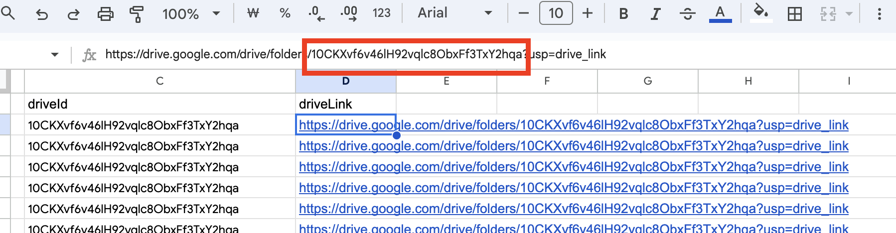

# GAS creatorlink mailling project

# 세팅

- 컴퓨터가 메일에 담긴 이름을 읽습니다.
- 컴퓨터가 메일에 해당 이미지를 구매자한테 담아서 보냅니다.

## 상품 이름 지정

- Product 시트에 홈페이지에 있는 상품명을 복사해서 name 에 집어넣습니다.

## 상품 이미지 링크 지정

- 마찬가지로 Product 시트에 메일로 보내고 싶은 이미지 링크를 복사해서 붙여넣습니다.

### 이미지 링크 쉽게 가져오는 팁!

1. F12 를 눌러 개발자 도구를 엽니다.
2. 새로 생긴 창의 화살표 검사하기 버튼 ( 빨간 네모박스)을 누릅니다.
3. 링크를 보려는 이미지로 마우스를 가져가서 활성화되면 클릭합니다.

1. 개발자 도구 창에 링크가 찾아진 걸 확인 (파란색으로 활성화 됨)
2. 아래 URL 클릭
3. 제대로된 이미지가 보이고, Current Source가 나오면 url 클릭

1. 링크 복사

## 파일 링크 지정

- File 시트로 가셔서 공유하려는 파일들의 이름, 드라이브 아이디, 링크를 입력해주세요.
- 맨 앞의 id 도 꼭 입력해주셔야 합니다. (그냥 순서대로 기입하면 됩니다.)
  
- Drive 링크와 Id 가져오는 법
  1. 구글 드라이브의 공유하려는 폴더에서 옆에 … 을 누릅니다.
  2. 공유 > 링크 복사를 하면 링크가 복사됩니다.
     
  3. 시트의 driveLink 자리에 붙여넣어 주세요
  4. 링크의 아이디 형식은 다음과 같습니다.
     - https://drive.google.com/drive/folders/[아이디]?usp=drive_link
       
     - 즉 folders/ 와 ? 사이의 암호같은 값이 아이디입니다.
     - 폴더가 아닌 파일이라면 files/ 와 ? 사이에 있을 거에요
  5. 아이디를 driveId 자리에 붙여넣어주세요.
  6. 상품별로 이름, 링크, 드라이브 아이디를 각각 세팅해주시면 됩니다.
- 세팅이 끝나면 주문 메일과 취소 메일은 자동으로 발송될 거에요.
- 파일 공유 , 취소도 자동으로 처리됩니다.

# 권한 (웹뷰)

- 주문 내역을 보기 위한 웹 뷰 주소는 맨 위에 적어두었습니다.
- 접속은 누구나 할 수 있지만 여기서 로드를 눌러 실행을 하려면, 스프레드 시트에 대한 권한이 필요 합니다.
  - 권한이 없는 경우 Loading에서 멈추고, F12 를 눌렀을 때 다음과 같은 화면이 뜹니다.
    
- 최초 접속시 스크립트 실행 승인이 필요합니다.
  
